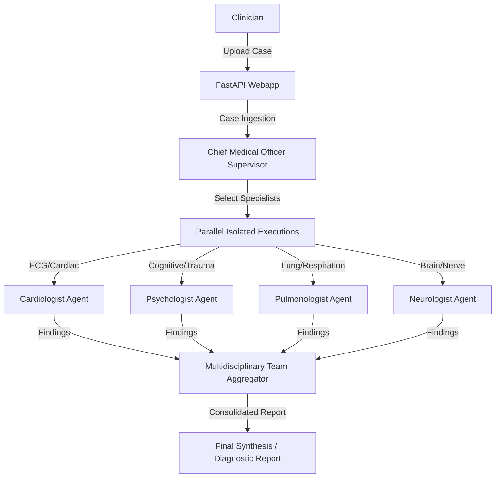

# MediConsensus – Collaborative Medical Diagnostics Platform (FastAPI + Octochains)

MediConsensus is a collaborative medical diagnostics platform that utilizes parallel isolated multi-agent reasoning to evaluate complex patient medical reports. By employing the **Octochains** framework, the system routes reports to specialized AI agents working concurrently in isolated threads to prevent logical contamination and cognitive bias ("groupthink").

---

## 1. System Architecture & Workflow

MediConsensus leverages a MapReduce-inspired multi-agent coordination architecture:
1. **Dossier Ingestion**: A clinician uploads a patient's medical report (as a text or PDF file) via the web dashboard.
2. **Supervisor Screening (Chief Medical Officer)**: A screening agent parses the medical report and dynamically decides which clinical specialists are required to evaluate this specific case.
3. **Parallel Isolated Reasoning (Specialists)**: The chosen specialist agents (Cardiologist, Psychologist, Pulmonologist, Neurologist) evaluate the report in parallel. Each specialist runs in a private, isolated thread and is completely unaware of their peers, preventing groupthink bias.
4. **Synthesis (Aggregator/Synthesizer)**: A multidisciplinary aggregator agent collects findings from the active specialists and synthesizes them into a final diagnostic report.
5. **Real-time Streaming & Visualizer**: The frontend visualizes the pipeline's progress in real-time, showing active agents, execution durations, diagnostic confidence metrics, and agent-specific clinical takeaways.



---

## 2. Directory Structure

The project directory structure is as follows:

```text
├── docs/
│   └── documentation.md       # Detailed architectural design and system workflows
├── medical_reports/           # Sample patient case reports (.txt) for quick testing
├── results/                   # Destination for reports generated by run_demo.py
├── Webapp/
│   ├── static/                # Single-page frontend assets
│   │   ├── logo/              # Brand image logo
│   │   ├── app.js             # Streams diagnosis events, updates state/UI, saves reports
│   │   ├── index.html         # Live diagnostic visualization canvas dashboard
│   │   └── style.css          # Core medical-themed styling (glassmorphism/ambient glows)
│   ├── main.py                # FastAPI app endpoints, CMO selection logic, streaming executor
│   ├── prompts.py             # Agent system and user prompts
│   └── README.md              # Quick setup guide for Webapp
├── .env                       # Local environment configurations (API keys)
├── .gitignore                 # Files excluded from git tracking
├── requirements.txt           # Python dependency declarations
└── run_demo.py                # CLI script to run multi-agent diagnosis on a sample report
```

---

## 3. Setup and Installation

### Prerequisites
- Python 3.10+ installed on your system.

### A. Clone and Setup Environment
1. Clone this repository to your local workspace.
2. In the root directory, create a `.env` file containing your API credentials (e.g. Groq, OpenAI, Google Gemini, OpenRouter):
   ```env
   GROQ_API_KEY=your_groq_key_here
   OPENAI_API_KEY=your_openai_key_here
   OPENROUTER_API_KEY=your_openrouter_key_here
   GOOGLE_API_KEY=your_google_key_here
   ```
   *(Note: The web UI also includes an API Settings panel to input these keys directly from your browser, which will be saved in your local storage.)*

3. Install the required dependencies:
   ```bash
   pip install -r requirements.txt
   ```

### B. Launching the Web Application
1. Navigate to the `Webapp` folder:
   ```bash
   cd Webapp
   ```
2. Start the development server using Uvicorn:
   ```bash
   uvicorn main:app --reload
   ```
3. Open your browser and navigate to:
   **`http://127.0.0.1:8000`**

### C. Running the Command Line Demo
Alternatively, you can run a quick multi-agent diagnostic run on a sample medical report directly from the CLI:
```bash
python run_demo.py
```
This reads the sample dossier from `medical_reports/Medical Report - David Wilson - Alzheimer’s Disease.txt`, runs the multi-specialist agents, and outputs a formatted markdown file to `results/Diagnostic_Report.md`.

---

## 4. Supported AI Agents

- **Chief Medical Officer (Supervisor)**: Determines which specialists should be triggered.
- **Cardiologist**: Examines cardiovascular tests, ECG findings, and structural issues.
- **Psychologist**: Evaluates cognitive status, trauma, depression, and general mental health.
- **Pulmonologist**: Evaluates respiratory systems, asthma, COPD, and lung infections.
- **Neurologist**: Analyzes brain scans, nerve conductivities, and neurological degradation patterns.
- **Multidisciplinary Team (Synthesizer)**: The official Octochains aggregator that synthesizes the inputs from the triggered specialists into a single unified clinical report.

> [!CAUTION]
> **Disclaimer:** This project is for research and educational purposes only. It is not intended for clinical use, or as a substitute for professional medical advice, diagnosis, or treatment.
