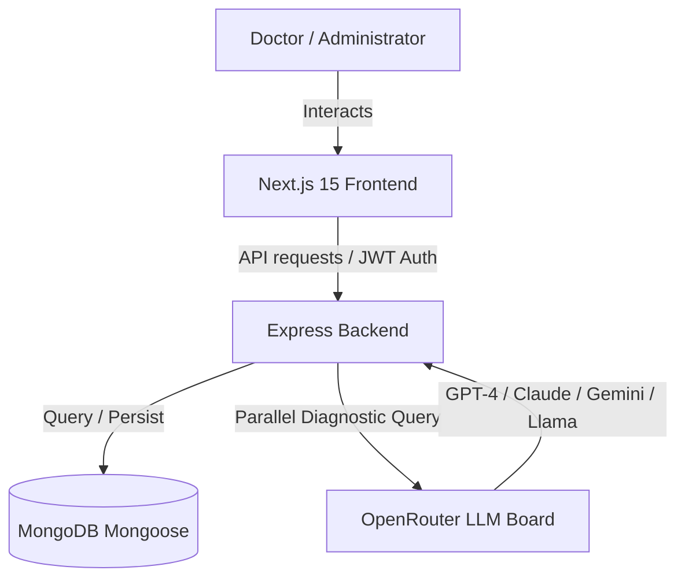

# MediConsensus Documentation

This document contains the Architecture, Database Schema, ER diagrams, and setup instructions for the new enterprise-grade MediConsensus application.

---

## 1. System Architecture

MediConsensus is built on a modern decoupled architecture:
*   **Frontend**: Next.js 15 (React 19, TypeScript) client running on port `3000`. Handles user interaction, state management via Zustand, concurrent API polling via TanStack Query, and smooth UI animations via Framer Motion.
*   **Backend**: Node.js/Express REST server running on port `5000`. Handles requests, authentication (JWT), file ingestion, database interaction, and orchestrates the parallel OpenRouter AI queries.
*   **Database**: MongoDB. Persists clinical records, user accounts, and AI metrics.



---

## 2. Database Schema (Mongoose Models)

### User Schema (`models/User.js`)
```javascript
{
  name: { type: String, required: true },
  email: { type: String, required: true, unique: true },
  password: { type: String, required: true },
  role: { type: String, enum: ['doctor', 'admin'], default: 'doctor' },
  hospital: { type: String, default: '' },
  avatar: { type: String, default: '' },
  createdAt: { type: Date, default: Date.now }
}
```

### Patient Schema (`models/Patient.js`)
```javascript
{
  name: { type: String, required: true },
  dob: { type: Date, required: true },
  gender: { type: String, enum: ['Male', 'Female', 'Other'], required: true },
  age: { type: Number, required: true },
  bloodGroup: { type: String, default: 'Unknown' },
  contactNumber: { type: String, default: '' },
  medicalHistory: { type: String, default: '' },
  createdAt: { type: Date, default: Date.now }
}
```

### Report Schema (`models/Report.js`)
```javascript
{
  patientId: { type: Schema.Types.ObjectId, ref: 'Patient', required: true },
  uploaderId: { type: Schema.Types.ObjectId, ref: 'User', required: true },
  fileName: { type: String, required: true },
  fileUrl: { type: String, required: true },
  fileType: { type: String, enum: ['pdf', 'txt', 'docx', 'png', 'jpg', 'jpeg'], required: true },
  ocrText: { type: String, default: '' },
  summary: { type: String, default: '' },
  tags: [{ type: String }],
  status: { type: String, enum: ['pending', 'processing', 'complete', 'failed'], default: 'pending' },
  createdAt: { type: Date, default: Date.now }
}
```

### AIResult Schema (`models/AIResult.js`)
```javascript
{
  reportId: { type: Schema.Types.ObjectId, ref: 'Report', required: true },
  modelName: { type: String, required: true },
  diagnosis: { type: String, required: true },
  probability: { type: Number, default: 0.0 },
  confidence: { type: Number, default: 0.0 },
  reasoningSummary: { type: String, default: '' },
  treatmentSuggestion: { type: String, default: '' },
  evidence: { type: String, default: '' },
  references: [{ type: String }],
  createdAt: { type: Date, default: Date.now }
}
```

### Consensus Schema (`models/Consensus.js`)
```javascript
{
  reportId: { type: Schema.Types.ObjectId, ref: 'Report', required: true },
  consensusScore: { type: Number, default: 0 },
  agreementScore: { type: Number, default: 0 },
  findingsMatch: [{
    finding: { type: String },
    agreeingModels: [{ type: String }],
    disagreeingModels: [{ type: String }]
  }],
  disagreements: [{
    topic: { type: String },
    description: { type: String }
  }],
  missingFindings: [{ type: String }],
  medicalRisks: [{ type: String }],
  recommendations: { type: String, default: '' },
  doctorOverride: { type: String, default: '' },
  status: { type: String, enum: ['automatic', 'overridden'], default: 'automatic' },
  reviewerId: { type: Schema.Types.ObjectId, ref: 'User' },
  createdAt: { type: Date, default: Date.now }
}
```

---

## 3. Core REST API Endpoints

### Authentication
*   `POST /api/auth/signup` - Register a new practitioner account.
*   `POST /api/auth/login` - Authenticate using email/password. Returns a JWT token.
*   `POST /api/auth/google` - Authenticate via Google client tokens.
*   `GET /api/auth/profile` - Get authenticated profile details. (Requires Bearer Token)

### Patient Records & AI Inquiries
*   `POST /api/reports/upload` - Securely ingest clinical documents (supports files via Multer).
*   `POST /api/reports/analyze` - Dispatch concurrent AI inquiries across target models.
*   `GET /api/reports` - Fetch cases board lists.
*   `GET /api/reports/:id` - Fetch detailed patient evaluations, AI cards, and consensus aggregates.
*   `POST /api/reports/:reportId/override` - Sign and submit override recommendations.

### Board Collaboration
*   `GET /api/reports/:reportId/comments` - Retrieve discussion thread.
*   `POST /api/reports/:reportId/comments` - Post comment/mention coordinate logs.

### Metrics & Analytics
*   `GET /api/analytics/dashboard` - Get dashboard widgets summary statistics and activity feeds.
